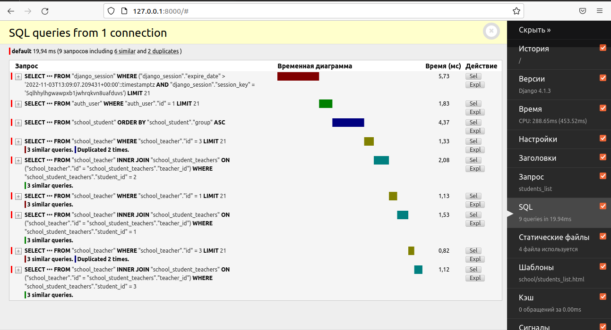
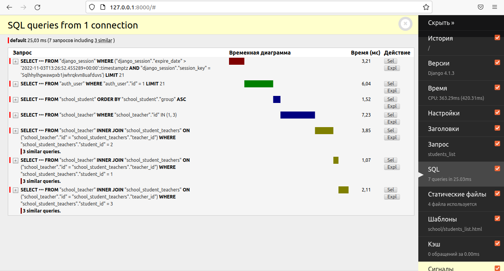

# Миграции

## Задание

Есть страница сайта школы.
При создании был не верно выбран тип связи `многие к одному`.
И теперь у ученика есть только один учитель и чтобы добавить к нему второго, требуется
заново добавлять ученика в базу.

Необходимо поменять модели и сделать отношение `многие ко многим` между Учителями и Учащимися.
Это решит проблемы текущей архитектуры.

Задача:

1. Поменять отношения моделей `Student` и `Teacher` с `Foreign key` на `Many to many`
2. Поправить шаблон списка учеников с учетом изменения моделей

## Примечание

Сначала примените текущую миграцию, затем загрузите исходные данные с помощью `loaddata` и после этого меняйте модели и делайте новые миграции.

В противном случае `loaddata` не сможет загрузить данные на новую схемы и данные придется заносить вручную.

## Подсказки

Для смены связи достаточно поменять поле модели с `ForeignKey` на `ManyToManyField`. Не забудьте поменять и название поля, ведь раньше был один учитель `teacher`, а теперь может быть много - `teachers`.

К полю `ManyToManyField` добавить параметр `related_name='students'` чтобы можно было получить список студентов у одного учителя.
После смены поля, необходимо создать новую миграцию и применить её к базе данных.

В шаблоне, для отображения всех учителей ученика, можно использовать вложенный цикл:

```html

<p>{{ teacher.name }}: {{ teacher.subject }}</p>

```

Более подробно примеры как работать с `ManyToManyField` можно посмотреть в документации Django.
https://docs.djangoproject.com/en/dev/ref/contrib/admin/#working-with-many-to-many-models

## Дополнительное задание

Проанализируйте число sql-запросов (напоминание: для этого можно использовать `django-debug-toolbar`) Для каждого студента будет выполняться отдельный запрос. Это не очень производительное решение - улучшите его с помощью `prefetch_related` ([документация](https://docs.djangoproject.com/en/3.2/ref/models/querysets/#prefetch-related)).



Количество запросов уменьшилось, а время выполнения увеличилось. Возможно prefetch-related использована мной не оптимально.
## Документация по проекту

Для запуска проекта необходимо:

#### Установить зависимости:

```bash
pip install -r requirements.txt
```

#### Провести миграцию:

```bash
python manage.py migrate
```

#### Загрузить тестовые данные:

***ВАЖНО***: после изменения моделей и применения миграций загрузить данные не получится! Выполните загрузку данных **ДО** изменения моделей.

```bash
python manage.py loaddata school.json
```

Если все же изменили модели, но не загрузили тестовые данные - ничего страшного, можно создать тестовые данные самостоятельно в админке.

#### Запустить отладочный веб-сервер проекта:

```bash
python manage.py runserver
```
